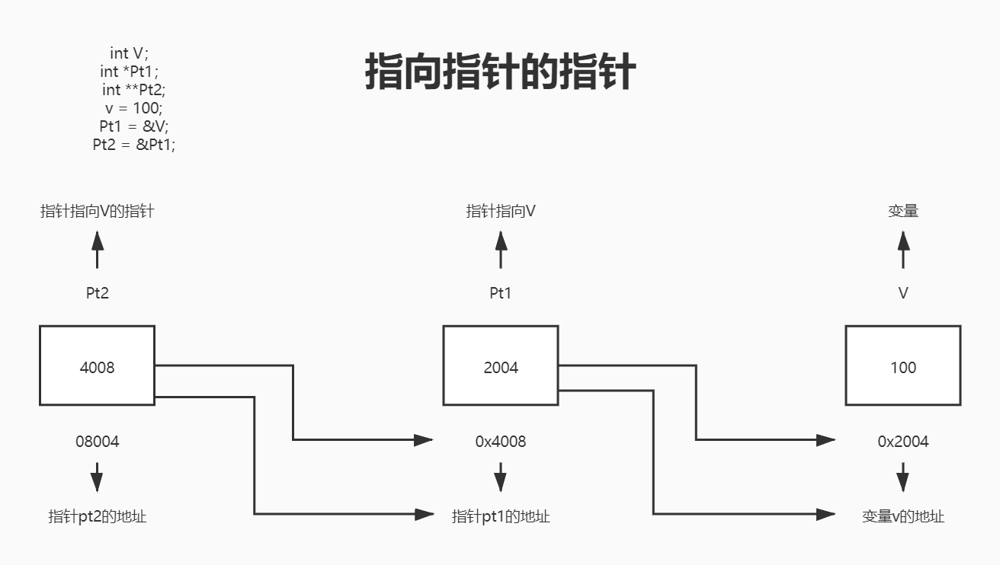

# C 指向指针的指针

[C 学习之路](../README.md)  
指向指针的指针是一种多级间接寻址的形式，或者说是一个指针链。通常，一个指针包含一个变量的地址。当定义一个指向指针的指针时，第一个指针包含了第二个指针的地址，第二个指针指向包含实际值的位置。  


一个指向指针的指针变量必须如下声明，即在变量名前放置两个星号。例如，下面声明了一个指向`int`类型指针的指针：

```c
int **var;
```

当一个目标值被一个指针间接指向到另一个指针时，访问这个值需要使用两个星号运算符，如下面实例所示：



```c
#include <stdio.h>

int main()
{
    int V;
    int *Pt1;
    int **Pt2;

    V = 100;

    /* 获取V的地址 */
    Pt1 = &V;

    /* 使用运算符&获取Pt1的地址 */
    Pt2 = &Pt1;

    /* 使用pptr获取值 */
    printf("var = %d\n", V);
    printf("Pt1 = %p\n", Pt1);
    printf("*Pt1 = %d\n", *Pt1);
    printf("Pt2 = %p\n", Pt2);
    printf("**Pt2 = %d\n", **Pt2);

    return 0;
}
```

当上面的代码被编译和执行时，运行结果：
> var = 100  
Pt1 = 000000000061FE14  
*Pt1 = 100  
Pt2 = 000000000061FE08  
**Pt2 = 100
