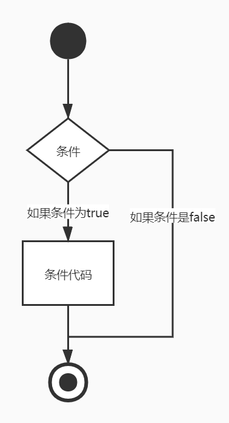

# C if 语句

[C 学习之路](../README.md)  
一个 **if 语句** 由一个布尔表达式后跟一个或多个语句组成。

----

## 语法

C语言中`if`语句的写法：

```c
if(boolean_expression)
{
    /* 如果布尔表达式为真执行的语句 */
}
```

如果布尔表达式为`true`，则`if`语句内的代码块将被执行。如果布尔表达式为`false`,则`if`语句结束后的第一组代码（闭括号后）将被执行。  
C语言把任何`非零`和`非空`的值假定为`true`，把`零`或`null`假定为`false`。  

## 流程图



## 实例

```c
#include <stdio.h>

int main()
{
    /* 局部变量定义 */
    int a = 10;

    /* 使用if语句检查布尔条件 */
    if(a < 20)
    {
        /* 如果条件为真，则输出下面的语句 */
        printf("a小于20\n");
    }
    printf("a的值是%d\n", a);
    return 0;
}
```

当上面的代码被编译和执行时，运行结果：
> a小于20  
a的值是10