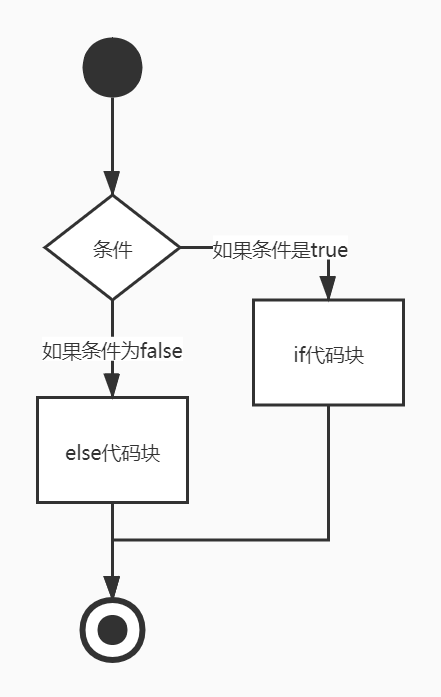

# C  if...else 语句

[C 学习之路](../README.md)  
一个 **if语句** 后可跟一个可选的 **else语句** ，else语句在布尔表达式为false时执行。

----

## 语法

C语言中`if...else`语句的语法：

```c
if(boolean_expression)
{
    /* 如果布尔表达式为真将执行的语句 */
}
else
{
    /* 如果布尔表达式为假将执行的语句 */
}
```

如果布尔表达式为`true`，则执行`if`块内的代码。如果布尔表达式为`false`，则执行`else`块内的代码。  
C语言把任何 **非零** 和 **非空** 的值假定为 `true`, 把 **零** 和 **null** 假定为 `false`。

## 流程图



## 实例

```c
#include <stdio.h>

int main()
{
    /* 局部变量定义 */
    int a = 100;

    /* 检查布尔条件 */
    if(a < 20)
    {
        /* 如果条件为真，则输出下面的语句*/
        printf("a 小于 20\n");
    }
    else
    {
        /* 如果条件为假，则输出下面的语句 */
        printf("a 大于 20\n");
    }
    printf("a 的值是 %d\n", a);
    return 0;
}
```

当上面的代码被编译和执行时，运行结果：
> a 大于 20  
a 的值是 100

## if...else if...else 语句

一个`if`语句后可跟一个可选的`else if...else`语句，这可用于测试多种条件。  
当使用`if...else if...else`语句时，以下几点需要注意：

- 一个`if`后可跟零个或一个`else`，`else`必须在所有`else if`之后。
- 一个`if`后可跟零个或多个`else if`，`else if`必须在`else`之前。
- 一旦某个`else if`匹配成功，其他的`else if`或`else`将不会被测试。

## if...else if...else 语法

C语言中的`if...else if...else`语句的语法：

```c
if(boolean_expression 1)
{
    /* 当布尔表达式 1 为真时执行 */
}
else if(boolean_expression 2)
{
    /* 当布尔表达式 2 为真时执行 */
}
else if(boolean_expression 3)
{
    /* 当布尔表达式 3 为真时执行 */
}
else
{
    /* 当上面条件都不为真时执行 */
}

## 实例

```c
#include <stdio.h>

int main()
{
    /* 局部变量定义 */
    int a = 100;

    /* 检查布尔条件 */
    if(a == 10)
    {
        /* 如果if条件为真，则输出下面的语句 */
        printf("a 的值是 10\n");
    }
    else if(a == 20)
    {
        /* 如果else if条件为真，则输出下面的语句 */
        printf("a 的值是 20\n");
    }
    else if(a == 30)
    {
        /* 如果else if条件为真，则输出下面的语句 */
        printf("a 的值是 30\n");
    }
    else
    {
        /* 如果上面条件都不为真，则输出下面的语句 */
        printf("没有匹配的值\n");
    }
    printf("a 的准确值是 %d\n", a);
    
    return 0;
}
```

当上面的代码被编译和执行时，运行结果：
> 没有匹配的值  
a 的准确值是 100
