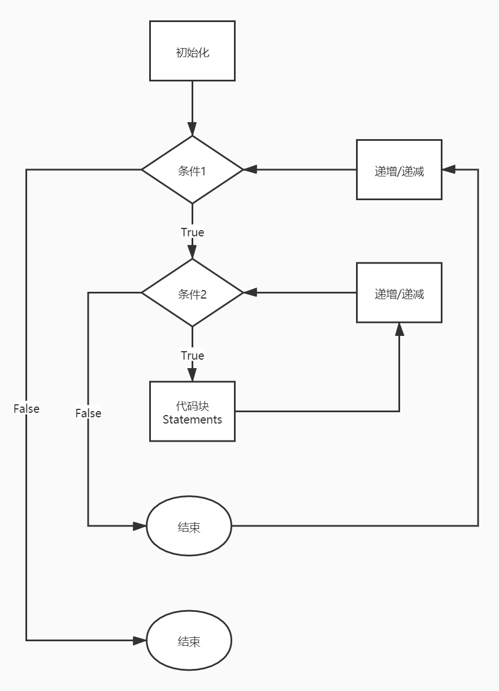
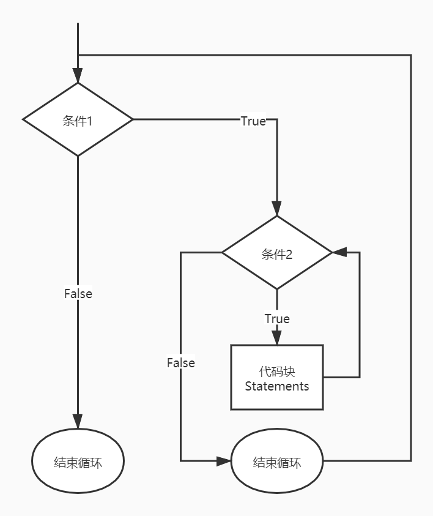
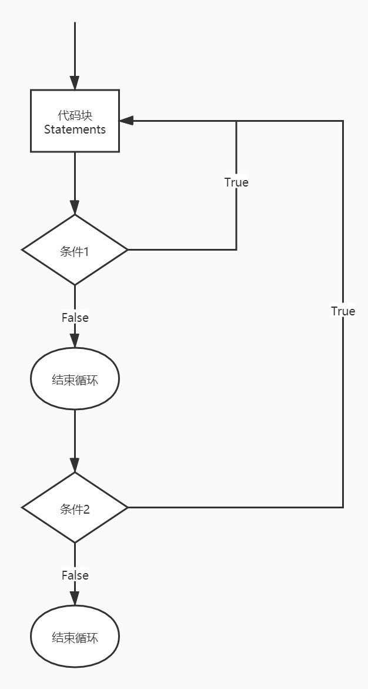

# C 嵌套循环

[C 学习之路](../README.md)  
C语言允许在一个循环内使用另一个循环，下面演示几个实例来说明这个概念。

## 语法

C语言中 **嵌套for循环** 语句的语法：

```c
for(initialization; condition; increment/decrement)
{
    statement(s);
    for(initialization; condition; increment/decrement)
    {
        statement(s);
        ...
    }
    ...
}
```

流程图：



C语言中 **嵌套while循环** 语句的语法：

```c
while(condition1)
{
    statement(s);
    while(condition2)
    {
        statement(s);
        ...
    }
    ...
}
```

流程图：



C语言中 **嵌套 do...while 循环** 语句的语法：

```c
do
{
    statement(s);
    do
    {
        statement(s);
        ...
    }while(condition2);
    ...
}while(condition1);
```

流程图：



关于嵌套循环有一点值得注意，可以在任何类型的循环内嵌套其他任何类型的循环。比如，一个 **for** 循环可以嵌套在一个 **while** 循环内，反之亦然。

## 实例

下面的程序使用了一个嵌套的 **for** 循环来查找2到100中的质数：

```c
#include <stdio.h>

int main()
{
    /* 局部变量定义 */
    int i, j;

    for(i = 2; i < 100; i++)
    {
        for(j = 2; j <= (i/j); j++)
        {
            if(!(i%j)) break; // 如果找到，则不是质数
        }
        if(j > (i/j)) printf("%d 是质数\n", i);
    }
    return 0;
}
```

当上面的代码被编译和执行时，运行结果：
> 2 是质数  
3 是质数  
5 是质数  
7 是质数  
11 是质数  
13 是质数  
17 是质数  
19 是质数  
23 是质数  
29 是质数  
31 是质数  
37 是质数  
41 是质数  
43 是质数  
47 是质数  
53 是质数  
59 是质数  
61 是质数  
67 是质数  
71 是质数  
73 是质数  
79 是质数  
83 是质数  
89 是质数  
97 是质数

```c
#include <stdio.h>
int main()
{
    int i=1, j;
    while (i <= 5)
    {
        j =1;
        while(j <= i)
        {
            printf("%d", j);
            j++;
        }
        printf("\n");
        i++;
    }
    return 0;
}
```

当上面的代码被编译和执行时，运行结果：
> 1  
12  
123  
1234  
12345

```c
#include <stdio.h>

int main()
{
    int i = 1, j;
    do
    {
        j=1;
        do
        {
            printf("*");
            j++;
        } while (j<=i);
        i++;
        printf("\n");
    } while (i <= 5);
    return 0;
}
```

当上面的代码被编译和执行时，运行结果：

> \*  
\**  
\***  
\****  
\*****
