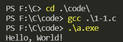
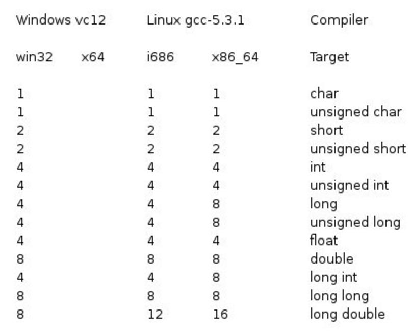
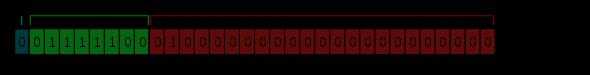
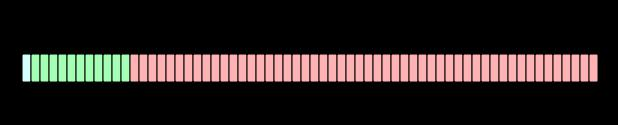
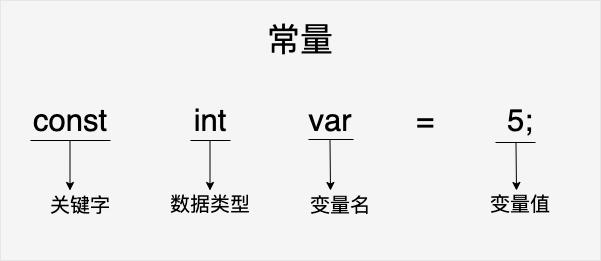
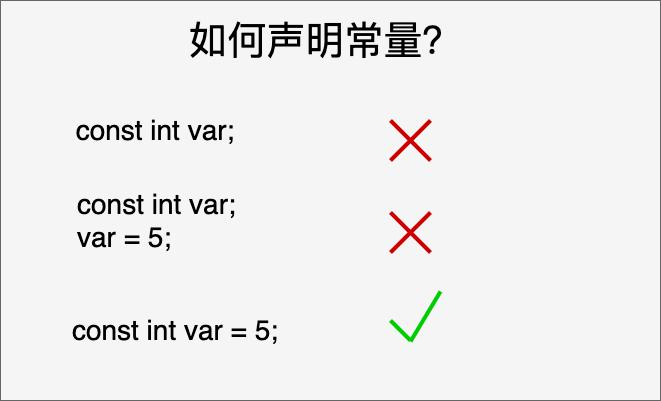

# C-学习之路

- [C-学习之路](#c-学习之路)
  - [C 程序结构](#c-程序结构)
    - [C Hello World 实例](#c-hello-world-实例)
    - [编译&执行C程序](#编译执行c程序)
  - [C 基本语法](#c-基本语法)
    - [C 的令牌（Token）](#c-的令牌token)
    - [分号 **;**](#分号-)
    - [注释](#注释)
    - [标识符](#标识符)
    - [关键字](#关键字)
      - [C99新增关键字](#c99新增关键字)
      - [C11新增关键字](#c11新增关键字)
    - [C中的空格](#c中的空格)
  - [C 数据类型](#c-数据类型)
    - [整数类型](#整数类型)
    - [浮点类型](#浮点类型)
    - [void类型](#void类型)
  - [C 变量](#c-变量)
    - [C中的变量定义](#c中的变量定义)
    - [C中的变量声明](#c中的变量声明)
    - [C中的左值（Lvalues）和右值（Rvalues）](#c中的左值lvalues和右值rvalues)
  - [C 常量](#c-常量)
    - [整数常量](#整数常量)
    - [浮点常量](#浮点常量)
    - [字符常量](#字符常量)
    - [字符串常量](#字符串常量)
    - [定义常量](#定义常量)
      - [#define 预处理器](#define-预处理器)
      - [const 关键字](#const-关键字)
  - [C 存储类](#c-存储类)
    - [auto存储类](#auto存储类)
    - [register存储类](#register存储类)
    - [static存储类](#static存储类)
    - [extern存储类](#extern存储类)
  - [C 运算符](#c-运算符)
    - [算术运算符](#算术运算符)
    - [关系运算符](#关系运算符)
    - [逻辑运算符](#逻辑运算符)
    - [位运算符](#位运算符)
    - [赋值运算符](#赋值运算符)
    - [杂项运算符 sizeof & 三元](#杂项运算符-sizeof--三元)
    - [C中的运算符优先级](#c中的运算符优先级)
  - [C 判断](#c-判断)
    - [判断语句](#判断语句)

## C 程序结构

### C Hello World 实例

C程序主要包括以下部分：

- 预处理器指令
- 函数
- 变量
- 语句&表达式
- 注释

现在看一段简单的代码，可以输出单词“Hello World”：

```c
#include <stdio.h>

int main() {
    /* 我的第一个C程序 */
    printf("Hello, World! \n");

    return 0;
}
```

接下来讲解一下这段程序：

1. 程序的第一行`#include <stdio.h>`是预处理器指令，高速C编译器在实际编译之前要包含stdio.h。
2. 下一行`int main()`是主函数，程序从这里开始执行。
3. 下一行`/*...*/`将会被编译器忽略，这里放置程序的注释内容。它们被称为程序的注释。
4. 下一行`printf("Hello, World! \n")`是C中另一个可用的函数，会在屏幕上显示信息“Hello，World！”。
5. 下一行`return 0`终止`main()`函数，并返回值0。

### 编译&执行C程序

接下来看看如何把源代码保存在一个文件中，以及如何编译并运行它。下面是简单的步骤：

1. 打开一个文本编辑器，添加上述代码。
2. 保存文件为[1-1.c](code\1-1.c)。
3. 打开终端，进入到保存文件所在的目录。
4. 键入`gcc 1-1.c`，输入回车，编译代码。
5. 如果代码中没有错误，命令提示符会跳到下一行，并生成[a.exe](code/a.exe)可执行文件。
6. 现在，键入[a.exe](code/a.exe)来执行程序。
7. 可以看到终端上显示“Hello，World!”。



请确保路径中已包含gcc编译器，并确保在包含源文件`1-1.c`的目录中运行它。  
如果是多个C代码的源码文件，编译方法如下：

> gcc test1.c test2.c -o main.exe  
./main.exe

`test1.c`与`test2.c`是两个源代码文件。

## C 基本语法

### C 的令牌（Token）

C程序由各种令牌组成，令牌可以是关键字、标识符、常量、字符串值，或者是一个符号。例如，下面的C语句包括五个令牌：

```c
printf("Hello, World! \n");
```

这五个令牌分别是：

```c
printf
(
  "Hello, World! \n"
)
;
```

### 分号 **;**

在C程序中，分号是语句结束符。也就是说，每个语句必须以分号结束。它表明一个逻辑实体的结束。  
例如，下面是两个不同的语句：

```c
printf("Hello, World! \n");
return 0;
```

### 注释

C语言有两种注释方式：

```c
// 单行注释
```

以`//`开始的单行注释，这种注释可以单独占一行。

```c
/* 单行注释 */
/*
  多行注释
  多行注释
  多行注释
 */
```

`/* */`这种格式的注释可以单行或者多行。  
不可以在注释内嵌套注释，注释也不能出现在字符串或者字符值中。

### 标识符

C标识符是用来标识变量、函数，或任何其他用户自定义项目的名称。一个标识符以字母`A-Z`或`a-z`或下划线`_`开始，后面跟零个或多个`字母`、`下划线`和`数字`（0-9）。  
C标识符内不允许出现标点字符，比如`@`、`$` 和 `%`。C 是区分大小写的编程语言。因此，在 C 中，`Manpower` 和 `manpower` 是两个不同的标识符。

### 关键字

下表列出了C中的保留字。这些保留字不能作为常量名、变量名或其他标识符名称。

|关键字|说明|
|--|--|
|auto|声明自动变量|
|break|跳出当前循环|
|case|开关语句分支|
|char|声明字符型变量或函数返回值类型|
|const|定义常量，如果一个变量被const修饰，那么它的值就不能再被改变|
|continue|结束当前循环，开始下一轮循环|
|default|开关语句中的“其他”分支
|do|循环语句的循环体|
|double|声明双精度浮点型变量或者函数返回值类型|
|else|条件语句否定分支（与if连用）|
|enum|声明枚举类型|
|extern|声明变量或函数是在其它文件或本文件的其他位置定义|
|float|声明浮点型变量或函数返回值类型|
|for|一种循环语句|
|goto|无条件跳转语句|
|if|条件语句|
|int|声明整型变量或函数|
|long|声明长整型变量或函数返回值类型|
|register|声明寄存器变量|
|return|子程序返回语句（可以带参数，也可不带参数）|
|short|声明短整型变量或函数|
|signed|声明有符号类型变量或函数|
|sizeof|计算数据类型或变量长度（即所占字节数）|
|static|声明静态变量|
|struct|声明结构体类型|
|switch|用于开关语句|
|typedef|用以给数据类型取别名|
|ungigned|声明无符号类型变量或函数|
|union|声明共用体类型|
|void|声明函数无返回值或无参数，声明无类型指针|
|volatile|说明变量在程序执行中可被隐含地改变|
|while|循环语句的循环条件|

#### C99新增关键字

|||||||
|--|--|--|--|--|--|
|_Bool|_Complex|_Imaginary|inline|restrict|

#### C11新增关键字

||||||||
|--|--|--|--|--|--|--|
|_Alignas|_Alignof|_Atomic|_Generic|_Noreturn|_Static_assert|_Thread_local|

### C中的空格

只包含空格的行，被称为空白行，可能带有注释，C编译器会完全忽视它。  
在C中，空格用于描述空白符、制表符、换行符和注释。空格分隔语句的各个部分，让编译器能识别语句中的某个元素（比如`int`）在哪里结束，下一个元素在哪里开始。因此，在下面的语句中：

```c
int age;
```

在这里，`int`和`age`之间必须至少有一个空白字符（通常是一个空白符），这样编译器才能够区分它们。另一个方面，在下面的语句中：

```c
fruit = apples + oranges; // 获取水果的总数
```

`fruit`和`=`，或者`=`和`apples`之间的空格字符不是必需的，但是为了增强可读性，可以根据需要适当增加一些空格。

## C 数据类型

在C语言中，数据类型指的是用于声明不同类型的变量或函数的一个广泛的系统。变量的类型决定了变量储存所占用的空间，以及如何解释存储的位模式。  
C中的类型可分为以下几种：

|序号|类型与描述|
|--|--|
|1| **基本类型：** 它们是算术类型，包括两种类型：整数类型和浮点数类型。|
|2| **枚举类型：** 它们也是算术类型，被用来定义在程序中只能赋予其一定的离散整数值的变量。|
|3| **void类型：** 类型说明符void表明没有可用的值。|
|4| **派生类型：** 它们包括：指针类型、数组类型、结构类型、共用体类型和函数类型。|

数组类型和结构类型统称为聚合类型。函数类型指的是函数返回值的类型。

### 整数类型

下表列出了关于标准整数类型的存储大小和值范围的细节：

|类型|存储大小|值范围|
|--|--|--|
|char|1字节|-128到127或0到255|
|unsigned char|1字节|0到255|
|signed char|1字节|-128到127|
|int|2或4字节|-32,768 到 32,767 或 -2,147,483,648 到 2,147,483,647|
|unsigned int|2或4字节|0 到 65,535 或 0 到 4,294,967,295|
|short|2字节|-32,768 到 32,767|
|unsigned short|2字节|0 到 65,535|
|long|4字节|-2,147,483,648 到 2,147,483,647|
|unsigned long|4字节|0 到 4,294,967,295|

**注意：** 各种类型的存储大小与系统位数有关，但目前通用的以64位系统为主。  
以下列出了32位系统与64位系统的存储大小的差别（window相同）：



为了得到某个类型或某个变量在特定平台上的准确大小，可以使用`sizeof`运算符。表达式`sizeof(type)`得到对象或类型的存储字节大小。下面的实例演示了获取int类型的大小：

```c
#include <stdio.h>
#include <limits.h>

int main() {
    printf("int 存储大小：%lu \n", sizeof(int));

    return 0;
}
```

`%lu`为32位无符号整型。  
当在Window上编译并执行上面的程序时，输入命令：
> gcc -fexec-charset=gbk .\3-1.c -o 3-1.exe  
> .\3-1.exe

运行结果：
> int 存储大小：4

`-fexec-charset=`的作用是更改编码格式，默认是`utf-8`，在Window中更改编码为`gbk`，则不会出现中文乱码。

### 浮点类型

下表列出了关于标准浮点类型的存储大小、值范围和精度的细节：

|类型|存储大小|值范围|精度|
|--|--|--|--|
|float|4字节|1.2E-38 到 3.4E+38|6位有效位|
|double|8字节|2.3E-308 到 1.7E+308|15位有效位|
|long double|16字节|3.4E-4932 到 1.1E+4932|19位有效位|

头文件`float.h`定义了宏，在程序中可以使用这些值和其他有关实数二进制表示的细节。下面的实例将输出浮点类型占用的储存空间以及它的范围值：

```c
#include <stdio.h>
#include <float.h>

int main() {
    printf("float 存储最大字节数：%lu \n", sizeof(float));
    printf("float 最小值： %E \n", FLT_MIN);
    printf("float 最大值：%E\n", FLT_MAX);
    printf("精度值：%d\n", FLT_DIG);

    return 0;
}
```

`%E`表示以指数形式输出单、双精度实数。  
当在Window上编译并执行上面的程序时，运行结果：
> float 存储最大字节数：4  
float 最小值： 1.175494E-038  
float 最大值：3.402823E+038  
精度值：6

### void类型

void类型指定没有可用的值。它通常用于以下三种情况下：

|序号|类型与描述|
|--|--|
|1| **函数返回为空** C中有各种函数都不返回值，或者可以说它们返回空。不返回值的函数的返回类型为空。例如`void exit(int status);`|
|2| **函数参数为空** C中有各种函数不接受任何参数。不带参数的函数可以接受一个`void`。例如`int rand(void);`
|3| **指针指向void** 类型为`void *`的指针代表对象的地址，而不是类型。例如，内存分配函数`void *malloc(size_t size);`返回指向`void`的指针，可以转换为任何数据类型|

## C 变量

变量其实只不过是程序可操作的存储区的名称。C中每个变量都有特定的类型，类型决定了变量存储的大小和布局，该范围内的值都可以存储在内存中，运算符可应用于变量上。  
变量的名称可以由字母、数字和下划线字符组成。它必须以字母或下划线开头。大写字母和小写字母是不同的，因为C是大小写敏感的。以下是几种基本的变量类型：
|类型|描述|
|--|--|
|char|通常是一个字节（八位），这是一个整数类型|
|int|整型，4个字节，取值范围 -2147483648 到 2147483647|
|float|单精度浮点值。单精度是这样的格式，1位符号，8位指数，23位小数|
|double|双精度浮点值。双精度是1位符号，11位指数，52位小数|
|void|表示类型的缺失|

C语言也允许定义各种其他类型的变量，比如枚举、指针、数组、结构、共用体等等，这个在后面讲解。

### C中的变量定义

变量定义就是告诉编译器在何处创建变量的存储，以及如何创建变量的存储。变量定义指定一个数据类型，并包含了该类型的一个或多个变量的列表，如下所示：

```c
type variable_list;
```

在这里，**type** 必须是一个有效的C数据类型，可以是`char`、`w_char`、`int`、`float`、`double`或任何用户自定义的对象，**variable_list** 可以由一个或多个标识符名称组成，多个标识符之间用逗号分隔。下面列出几个有效的声明：

```c
int i, j, k;
char c, ch;
float f, salary;
double d;
```

行`int i, j, k;`声明并定义了变量`i`、`j`和`k`，这指示编译器创建类型为`int`的名为`i`、`j`、`k`的变量。  
变量可以在声明的时候被初始化（指定一个初始值）。初始化器由一个等号，后跟一个常量表达式组成，如下所示：

```c
type variable_name = value;
```

下面列举几个实例：

```c
extern int d = 3, f = 5; // d和f的声明和初始化
int d =3, f = 5; // 定义并初始化d和f
byte z =22; //定义并初始化z
char x = 'x'; //变量x的值为'x'
```

不带初始化的定义：带有静态存储持续时间的变量会被隐式初始化为`NULL`（所有字节的值都是0），其他所有变量的初始值是未定义的。

### C中的变量声明

变量声明向编译器保证变量以指定的类型和名称的存在，这样编译器在不需要知道变量完整细节的情况下也能继续进一步的编译。变量声明只在编译时有它的意义，在程序连接时编译器需要实际的变量声明。  
变量的声明有两种情况：

1. 一种是需要建立存储空间的。例如：`int a`在声明的时候就已经建立了存储空间。
2. 另一种是不需要建立存储空间的，通过使用`extern`关键字声明变量名而不定义它。例如：`extern int a`其中变量`a`可以在别的文件中定义的。除非有`extern`关键字，否则都是变量的定义。

```c
extern int i; // 声明，不是定义
int i; // 声明，也是定义
```

尝试下面的实例，其中，变量在头部已经被声明，但是定义与初始化在主函数内：

```c
#include <stdio.h>

// 函数外定义变量x和y
int x;
int y;
int add_two_num()
{
    // 函数内声明变量x和y为外部变量
    extern int x;
    extern int y;
    // 给外部变量（全局变量）x和y赋值
    x = 1;
    y = 2;
    return x+y;
}

int main()
{
    int result;
    // 调用函数add_two_num
    result = add_two_num();

    printf("result 为：%d", result);
    return 0;
}
```

当上面的代码被编译和运行时，运行结果：
> result 为：3

如果需要在一个源文件中引用另外一个源文件中定义的变量，只需要在引用的文件中将变量加上`extern`关键字的声明即可。

```c
#include <stdio.h>
/* 外部变量声明 */
extern int x;
extern int y;
int add_two_num()
{
    return x+y;
}
```

```c
#include <stdio.h>

/* 定义两个全局变量 */
int x = 1;
int y = 2;
int add_two_num();
int main()
{
    int result;
    result = add_two_num();
    printf("result 为：%d\n", result);
    return 0;
}
```

当上面的代码被编译和运行时，运行结果：
> gcc -fexec-charset=gbk .\4-2.c .\4-3.c -o 4-2+3.exe  
> .\4-2+3.exe
> result 为：3

### C中的左值（Lvalues）和右值（Rvalues）

C中有两种类型的表达式：

1. **左值（Lvalues）：** 指向内存位置的表达式被称为左值（Lvalue）表达式。左值可以出现在赋值号的左边或右边。
2. **右值（Rvalues）：** 术语右值（Rvalue）指的是存储在内存中某些地址的数值。右值是不能对其进行赋值的表达式，也就是说，右值可以出现在赋值号的右边，但不能出现在赋值号的左边。

变量是左值，因此可以出现在赋值号的左边。数值型的字面值是右值，因此不能被赋值，不能出现在赋值号的左边。下面是一个有效的语句：

```c
int g = 20;
```

但是下面这个就不是一个有效的语句，会在编译时产生错误：

```c
10 = 20;
```

## C 常量

常量是固定值，在程序执行期间不会改变。这些固定的值，又叫做 **字面量** 。  
常量可以是任何的基本数据类型，比如整型常量、浮点常量、字符常量、字符串字面量，也有枚举常量。  
**常量** 就像是常规的变量，只不过常量的值在定义后不能进行修改。  

### 整数常量

整数常量可以是十进制、八进制或者十六进制的常量。前缀指定基数：`0x`或`0X`表示十六进制，`0`表示八进制，不带前缀则默认表示十进制。  
整数常量也可以带一个后缀，后缀是`U`和`L`的组合，`U`表示无符号整数（unsigned），`L`表示长整数（long）。后缀可以是大写，也可以是小写，U和L的顺序任意。
下面列举几个整数常量的实例：

```c
212 /* 合法的 */
215u /* 合法的 */
0xFeeL /* 合法的 */
078 /* 非法的：8不是八进制的数字 */
032UU /* 非法的：不能重复后缀 */
```

以下是各种类型的整数常量的实例：

```c
85 /* 十进制 */
0213 /* 八进制 */
0x4b /* 十六进制 */
30 /* 整数 */
30u /* 无符号整数 */
30l /* 长整数 */
30ul /* 无符号长整数 */
```

### 浮点常量

浮点常量是由整数部分、小数点、小数部分和指数部分组成。可以使用小数形式或者指数形式来表示浮点常量。  
当使用小数形式表示时，必须包含整数部分、小数部分，或者同时包含两者。当使用指数形式时，必须包含小数点、指数，或者同时包含两者。带符号的指数是用e或E引入的。  
下面列举几个浮点常量的实例：

```c
3.14159 /* 合法的 */
314159E-5L /* 合法的 */
510E /* 非法的：不完整的指数 */
210f /* 非法的：没有小数或指数 */
.e55 /* 非法的：缺少整数或分数 */
```

### 字符常量

字符常量是括在单引号中，例如，`'x'`可以存储在`char`类型的简单变量中。  
字符常量可以是一个普通的字符（例如`'x'`）、一个转义序列（例如`'\t'`），或一个通用的字符（例如`'\u02C0'`）。  
在C中，有一些特定的字符，当它们前面有反斜杠时，它们就具有特殊的含义，被用来表示如换行符（`\n`）或制表符（`\t`）等。下表列出了一些这样的转义序列码：

|转义序列|含义|
|--|--|
|\\|\字符|
|\'|'字符|
|\''|''字符|
|\?|?字符|
|\a|警报铃声|
|\b|退格键|
|\f|换页符|
|\n|换行符|
|\r|回车|
|\t|水平制表符|
|\v|垂直制表符|
|\ooo|一到三位的八进制数|
|\xhh|一个或多个数字的十六进制数|

下面的实例显示了一些转义序列字符：

```c
#include <stdio.h>

int main()
{
    printf("Hello\tWorld\n\n");

    return 0;
}
```

当上面的代码被编译和执行时，运行结果：
>Hello   World  

### 字符串常量

字符串字面值或常量是括在双引号`""`中的。一个字符串包含类似于字符常量的字符：普通的字符、转义序列和通用的字符。  
可以使用`\`做分隔符，把一个很长的字符串常量进行分行。  
下面的实例显示了一些字符串常量。下面这三种形式所显示的字符串是相同的。

```c
"hello, dear"
"hello, \
dear"
"hello, ""d""ear"
```

### 定义常量

在C中，有两种简单的定义常量的方式：

1. 使用`#define`预处理器。
2. 使用`const`关键字。

#### #define 预处理器

下面是使用`#define`预处理器定义常量的形式：

```c
#define identifier value
```

具体看下面的实例：

```c
#include <stdio.h>

#define LENGTH 10
#define WIDTH 5
#define NEWLINE '\n'

int main()
{
    int area;

    area = LENGTH * WIDTH;
    printf("value of area: %d", area);
    printf("%c", NEWLINE);

    return 0;
}
```

当上面的代码被编译和执行时，运行结果：
> value of area: 50

#### const 关键字

可以使用`const`前缀声明指定类型的常量，如下所示：

```c
const type variable = value;
```


`const`声明常量要在一个语句内完成：

具体看下面的例子：

```c
#include <stdio.h>

int main()
{
    const int LENGTH = 10;
    const int WIDTH = 5;
    const char NEWLINE = '\n';
    int area;

    area = LENGTH * WIDTH;
    printf("value of area : %d", area);
    printf("%c", NEWLINE);

    return 0;
}
```

当上面的代码被编译和执行时，运行结果：
> value of area : 50

**注意：** 把常量定义为大写字母形式，是一个很好的编程习惯。

## C 存储类

储存类定义C程序中变量、函数的范围（可见性）和生命周期。这些说明符放置在它们所修饰的类型之前。下面列出C程序中可用的存储类：

- auto
- register
- static
- extern

### auto存储类

`auto`存储类是所有局部变量默认的存储类。

```c
{
  int mount;
  auto int month; 
}
```

上面的实例定义了两个带有相同存储类的变量，`auto`只能用在函数内，即`auto`只能修饰局部变量。

### register存储类

`register`存储类用于定义存储在寄存器中而不是RAM中的局部变量。这意味着变量的最大尺寸等于寄存器的大小（通常是一个词），且不能对它应用一元的`'&'`运算符（因为它没有内存位置）。

```c
{
  register int miles;
}
```

寄存器只用于需要快速访问的变量，比如计数器。还应注意的是，定义`register`并不意味着变量将被存储在寄存器中，它意味着变量可能存储在寄存器中，这取决于硬件和实现的限制。

### static存储类

`static`存储类指示编译器在程序的生命周期内保持局部变量的存在，而不需要在每次它进入和离开作用域时进行创建和销毁。因此，使用`static`修饰局部变量可以在函数调用之间保持局部变量的值。  
`static`修饰符也可以应用于全局变量。当`static`修饰全局变量时，会使变量的作用域限制在声明它的文件内。
全局声明的一个`static`变量或方法可以被任何函数或方法调用，只要这些方法出现在跟`static`变量或方法同一个文件中。  
以下实例演示了`static`修饰全局变量和局部变量的应用：

```c
#include <stdio.h>

/* 函数声明 */
void func1(void);

/* 全局变量 - static是默认的 */
static int count = 10;

int main()
{
    while (count--)
    {
        func1();
    }
    return 0;
}

void func1(void)
{
    /* 'thingy'是'func1'的局部变量 - 只初始化一次
     * 每次调用函数'func1''thingy'值不会被重置。
     */
    static int thingy = 5;
    thingy++;
    printf("thingy 为 %d, count 为 %d\n", thingy, count);
}
```

实例中`count`作为全局变量可以在函数内使用，`thingy`使用`static`修饰后，不会在每次调用时重置。  
当上面的代码被编译和执行时，运行结果：
> thingy 为 6, count 为 9  
thingy 为 7, count 为 8  
thingy 为 8, count 为 7  
thingy 为 9, count 为 6  
thingy 为 10, count 为 5  
thingy 为 11, count 为 4  
thingy 为 12, count 为 3  
thingy 为 13, count 为 2  
thingy 为 14, count 为 1  
thingy 为 15, count 为 0

### extern存储类

`extern`存储类用于提供一个全局变量的引用，全局变量对所有的程序文件都是可见的。当使用`extern`时，对于无法初始化的变量，会把变量名指向一个之前定义过的存储位置。  
当有多个文件且定义了一个可以在其他文件中使用的全局变量或函数时，可以在其他文件中使用`extern`来得到已定义的变量或函数的引用。  
`extern`修饰符通常用于当有两个或多个文件共享相同的全局变量或函数的时候，如下所示：

```c
#include <stdio.h>

int count;
extern void write_extern();

int main()
{
    count = 5;
    write_extern();
}
```

```c
#include <stdio.h>

extern int count;

void write_extern(void)
{
    printf("count is %d\n", count);
}
```

在这里，第二个文件中的`extern`关键字用于声明已经在第一个文件[6-2.c](code\6-2.c)中定义的`count`。现在，编译这两个文件，如下所示：
> gcc -fexec-charset=gbk .\6-2.c .\6-3.c -o 6-2+3.exe

这会产生[6-2+3.exe](code\6-2+3.exe)可执行程序，当程序被执行时，运行结果：
> count is 5

## C 运算符

运算符是一种告诉编译器执行特定的数学或逻辑操作的符号。C语言内置了丰富的运算符，并提供了以下类型的运算符：

- 算术运算符
- 关系运算符
- 逻辑运算符
- 位运算符
- 赋值运算符
- 杂项运算符

### 算术运算符

下表显示了C语言支持的所有算术运算符。假设变量`A`的值为10，变量`B`的值为20，则：

|运算符|描述|实例|
|--|--|--|
|+|把两个操作数相加|A+B将得到30|
|-|从第一个操作数中减去第二个操作数|A-B将得到-10|
|* |把两个操作数相乘|A*B将得到200|
|/|分子除以分母|B/A将得到2|
|%|取模运算符，整除后的余数|B%A将得到0|
|++|自增运算符，整数值增加1|A++将得到11|
|--|自减运算符，整数值减少1|A--将得到9|

通过下面的实例，了解C语言中所有可用的算术运算符：

```c
#include <stdio.h>

int main() {
    int a = 21;
    int b = 10;
    int c;

    c = a + b;
    printf("Line 1 - c 的值是 %d\n", c);
    c = a - b;
    printf("Line 2 - c 的值是 %d\n", c);
    c = a * b;
    printf("Line 3 - c 的值是 %d\n", c);
    c = a / b;
    printf("Line 4 - c 的值是 %d\n", c);
    c = a % b;
    printf("Line 5 - c 的值是 %d\n", c);
    c = a++; // 赋值后再加1，c为21，a为22
    printf("Line 6 - c 的值是 %d\n", c);
    c = a--; // 赋值后再减1，c为22，a为21
    printf("Line 7 - c 的值是 %d\n", c);
}
```

当上面的代码被编译和执行时，运行结果：
> Line 1 - c 的值是 31  
Line 2 - c 的值是 11  
Line 3 - c 的值是 210  
Line 4 - c 的值是 2  
Line 5 - c 的值是 1  
Line 6 - c 的值是 21  
Line 7 - c 的值是 22

以下实例演示了`a++`与`++a`的区别：

```c
#include <stdio.h>

int main()
{
    int c;
    int a = 10;
    c = a++;
    printf("先赋值后运算：\n");
    printf("Line 1 - c 的值是 %d\n", c);
    printf("Line 2 - a 的值是 %d\n", a);
    a = 10;
    c = a--;
    printf("Line 3 - c 的值是 %d\n", c);
    printf("Line 4 - a 的值是 %d\n", a);

    printf("先运算后赋值：\n");
    a = 10;
    c = ++a;
    printf("Line 5 - c 的值是 %d\n", c);
    printf("Line 6 - a 的值是 %d\n", a);
    a = 10;
    c = --a;
    printf("Line 7 - c 的值是 %d\n", c);
    printf("Line 8 - a 的值是 %d\n", a);
}
```

运行结果：
> 先赋值后运算：  
Line 1 - c 的值是 10  
Line 2 - a 的值是 11  
Line 3 - c 的值是 10  
Line 4 - a 的值是 9  
先运算后赋值：  
Line 5 - c 的值是 11  
Line 6 - a 的值是 11  
Line 7 - c 的值是 9  
Line 8 - a 的值是 9

### 关系运算符

下表显示了C语言支持的所有关系运算符。假设变量`A`的值为10，变量`B`的值为20，则：

|运算符|描述|实例|
|--|--|--|
|==|检查两个操作数的值是否相等，如果相等则条件为真|（A==B）为假|
|!=|检查两个操作数的值是否相等，如果不相等则条件为真|（A!=B）为真|
|>|检查左操作数的值是否大于右操作数的值，如果是则条件为真|（A>B）为假|
|<|检查左操作数的值是否小于右操作数的值，如果是则条件为真|（A< B）为真|
|>=|检查左操作数的值是否大于或等于右操作数的值，如果是则条件为真|（A>=B）为假|
|<=|检查左操作数的值是否小于或等于右操作数的值，如果是则条件为真|（A<=B）为真|

看下面的实例，了解C语言中所有可用的关系运算符：

```c
#include <stdio.h>

int main()
{
    int a = 21;
    int b = 10;
    int c;

    if(a == b)
    {
        printf("Line 1 - a 等于 b\n");
    }
    else
    {
        printf("Line 1 - a 等于 b\n");
    }
    if (a < b)
    {
        printf("Line 2 - a 小于 b\n");
    }
    else
    {
        printf("Line 2 - a 不小于 b\n");
    }
    if (a > b)
    {
        printf("Line 3 - a 大于 b\n");
    }
    else
    {
        printf("Line 3 - a 不大于 b\n");
    }
    /* 改变 a 和 b 的值 */
    a = 5;
    b = 20;
    if (a <= b)
    {
        printf("Line 4 - a 小于或等于 b\n");
    }
    if (b >= a)
    {
        printf("Line 5 - b 大于或等于 a\n");
    }
    return 0;
}
```

当上面的代码被编译和执行时，运行结果：
> Line 1 - a 等于 b  
Line 2 - a 不小于 b  
Line 3 - a 大于 b  
Line 4 - a 小于或等于 b  
Line 5 - b 大于或等于 a

### 逻辑运算符

下表显示了C语言支持的所有关系逻辑运算符。假设变量`A`的值为1，变量`B`的值为0，则：
|运算符|描述|实例|
|--|--|--|
|&&|称为逻辑与运算符。如果两个操作数都非零，则条件为真|（A&&B）为假|
|\|\||称为逻辑或运算符。如果两个操作数中有任何一个非零，则条件为真|（A\|\|B）为真|
|!|称为逻辑非运算符。用来逆转操作数的逻辑状态。如果条件为真则逻辑非运算符使其为假|!（A&&B）为真|

请看下面的实例，了解C语言中所有可用的逻辑运算符：

```c
#include <stdio.h>

int main()
{
    int a = 5;
    int b = 20;
    int c;

    if (a && b)
    {
        printf("Line 1 - 条件为真\n");
    }
    else
    {
        printf("Line 1 - 条件为假\n");
    }
    if (a || b)
    {
        printf("Line 2 - 条件为真\n");
    }
    else
    {
        printf("Line 2 - 条件为假\n");
    }
    /* 改变a和b的值 */
    a = 0;
    b = 10;
    if (a && b)
    {
        printf("Line 3 - 条件为真\n");
    }
    else
    {
        printf("Line 3 - 条件为假\n");
    }
    if (!(a && b))
    {
        printf("Line 4 - 条件为真\n");
    }
    else
    {
        printf("Line 4 - 条件为假\n");
    }
    return 0;   
}
```

当上面的代码被编译和执行时，运行结果：
> Line 1 - 条件为真  
Line 2 - 条件为真  
Line 3 - 条件为假  
Line 4 - 条件为真

### 位运算符

位运算符作用于位，并逐位执行操作。`&`、`|`和`^`的真值表如下所示：

|p|q|p&q|p\|q|p^q|
|--|--|--|--|--|
|0|0|0|0|0|
|0|1|0|1|1|
|1|1|1|1|0|
|1|0|0|1|1|

假设如果A=60，且B=13，现在以二进制格式表示，如下所示：  
A=0011 1100  
B=0000 1101

----
A&B = 0000 1100  
A|B = 0011 1101  
A^B = 0011 0001  
~A = 1100 0011  
下表显示了C语言支持的位运算符。假设变量`A`的值为60，变量`B`的值为13，则：

|运算符|描述|实例|
|--|--|--|
|&|按位与操作，按二进制进行“与”运算。运算规则：</br>`0&0=0;`</br>`0&1=0`</br>`1&0=0;`</br>`1&1=1;`|（A&B）将得到12，即为00001100|
|\||按位或操作，按二进制进行“或”运算。运算规则：</br>`0\|0=0;`</br>`0\|1=1;`</br>`1\|0=1;`</br>`1\|1=1;`|（A\|B）将得到61，即为0011 1101|
|^|异或运算符，按二进制进行“异或”运算。运算规则：</br>`0^0=0;`</br>`0^1=1;`</br>`1^0=1;`</br>`1^1=0;`|（A^B）将得到49，即为0011 0001|
|~|取反运算符，按二进制进行“取反”运算。运算规则：</br>`~1=-2;`</br>`~0=-1;`|（~A）将得到-61，即为1100 0011，一个有符号二进制数的补码形式|
|<<|二进制左移运算符。将一个运算对象的各二进制位全部左移若干位（左边的二进制位丢弃，右边补0）|A<<2将得到240，即为1111 0000|
|>>|二进制右移运算符。将一个数的各二进制位全部右移若干位，正数左补0，负数左补1，右边丢弃|

看下面的实例，了解C语言中所有可用的位运算符：

```c
#include <stdio.h>

int main()
{
    unsigned int a = 60; /* 60 = 0011 1100 */
    unsigned int b = 13; /* 13 = 0000 1101 */
    int c = 0;

    c = a & b; /* 12 = 0000 1100 */
    printf("Line 1 - c 的值是 %d\n", c);

    c = a | b; /* 61 = 0011 1101 */
    printf("Line 2 - c 的值是 %d\n", c);

    c = a ^ b; /* 49 = 0011 0001 */
    printf("Line 3 - c 的值是 %d\n", c);

    c = ~a; /* -61 = 1100 0011 */
    printf("Line 4 - c 的值是 %d\n", c);

    c = a << 2; /* 240 = 1111 0000 */
    printf("Line 5 - c 的值是 %d\n", c);

    c = a >> 2; /* 15 = 0000 1111 */
    printf("Line 6 - c 的值是 %d\n", c);
}
```

当上面的代码被编译和执行时，运行结果：
> Line 1 - c 的值是 12  
Line 2 - c 的值是 61  
Line 3 - c 的值是 49  
Line 4 - c 的值是 -61  
Line 5 - c 的值是 240  
Line 6 - c 的值是 15

### 赋值运算符

下表列出了C语言支持的赋值运算符：

|运算符|描述|实例|
|--|--|--|
|=|简单的赋值运算符，把右边操作数的值赋给左边操作数|C=A+B将把A+B的值赋给C|
|+=|加且赋值运算符，把右边操作数加上左边操作数的结果赋值给左边操作数|C+=A相当于C=C+A|
|-=|减且赋值运算符，把左边操作数减去右边操作数的结果赋值给左边操作数|C-=A相当于C=C-A|
|\*=|乘且赋值运算符，把右边操作数乘以左边操作数的结果赋值给左边操作数|C\*=A相当于C=C*A|
|/=|除且赋值运算符，把左边操作数除以右边操作数的结果赋值给左边操作数|C/=A相当于C=C/A|
|%=|求模切赋值运算符，求两个操作数的模赋值给左边操作数|C%=A相当于C=C%A|
|<<=|左移且赋值运算符|C<<=2相当于C=C<<2|
|>>=|右移且赋值运算符|C>>=2等同于C=C>>2|
|&=|按位与且赋值运算符|C&=2等同于C=C&2|
|^=|按位异或且赋值运算符|C^=2等同于C=C^2|
|\|=|按位或且赋值运算符|C\|=2等同于C=C\|2|

看下面是实例，了解C语言中所有可用的赋值运算符：

```c
#include <stdio.h>

int main()
{
    int a = 21;
    int c;

    c = a;
    printf("Line 1 - = 运算符实例，c的值为 %d\n", c);

    c += a;
    printf("Line 2 - += 运算符实例，c的值为 %d\n", c);

    c -= a;
    printf("Line 3 - -= 运算符实例，c的值为 %d\n", c);

    c *= a;
    printf("Line 4 - *= 运算符实例，c的值为 %d\n", c);

    c /= a;
    printf("Line 5 - /= 运算符实例，c的值为 %d\n", c);

    c = 200;
    c %= a;
    printf("Line 6 - %= 运算符实例，c的值为 %d\n", c);

    c <<= 2;
    printf("Line 7 - <<= 运算符实例，c的值为 %d\n", c);

    c >>= 2;
    printf("Line 8 - >>= 运算符实例，c的值为 %d\n", c);

    c &= 2;
    printf("Line 9 - &= 运算符实例，c的值为 %d\n", c);

    c ^= 2;
    printf("Line 10 - ^= 运算符实例，c的值为 %d\n", c);

    c |= 2;
    printf("Line 11 - |= 运算符实例，c的值为 %d\n", c);
}
```

当上面的代码被编译和执行时，运行结果：
> Line 1 - = 运算符实例，c的值为 21  
Line 2 - += 运算符实例，c的值为 42  
Line 3 - -= 运算符实例，c的值为 21  
Line 4 - *= 运算符实例，c的值为 441  
Line 5 - /= 运算符实例，c的值为 21  
Line 6 - = 运算符实例，c的值为 11  
Line 7 - <<= 运算符实例，c的值为 44  
Line 8 - >>= 运算符实例，c的值为 11  
Line 9 - &= 运算符实例，c的值为 2  
Line 10 - ^= 运算符实例，c的值为 0  
Line 11 - |= 运算符实例，c的值为 2

### 杂项运算符 sizeof & 三元

下表列出了C语言支持的其他一些重要的运算符，包括`sizeof`和`?:`：

|运算符|描述|实例|
|--|--|--|
|sizeof()|返回变量的大小|sizeof(a)将返回4，其中a是整数|
|&|返回变量的地址|&a，将给出变量的实际地址|
|*|指向一个变量|\*a，将指向一个变量|
|?:|条件表达式|如果条件为真？则值为X:否则值为Y|

请看下面的实例，了解C语言中所有可用的杂项运算符：

```c
#include <stdio.h>

int main()
{
    int a = 4;
    short b;
    double c;
    int* ptr;

    /* sizeof 运算符实例 */
    printf("Line 1 - 变量 a 的大小 = %lu\n", sizeof(a));
    printf("Line 2 - 变量 b 的大小 = %lu\n", sizeof(b));
    printf("Line 3 - 变量 c 的大小 = %lu\n", sizeof(c));

    /* & 和 * 运算符实例 */
    ptr = &a; /* `ptr`现在包含`a`的地址 */
    printf("a的值是%d\n", a);
    printf("*ptr是%d\n", *ptr);

    /* 三元运算符实例 */
    a = 10;
    b = (a == 1) ? 20: 30;
    printf("b的值是%d\n", b);

    b = (a == 10) ? 20: 30;
    printf("b的值是%d\n", b);
}
```

当上面的代码被编译和执行时，运行结果：
> Line 1 - 变量 a 的大小 = 4  
Line 2 - 变量 b 的大小 = 2  
Line 3 - 变量 c 的大小 = 8  
a的值是4  
*ptr是4  
b的值是30  
b的值是20

### C中的运算符优先级

运算符的优先级确定表达式中项的组合。这会影响到一个表达式如何计算。某些运算符比其他运算符有更高的优先级，例如，乘除运算符具有比加减运算符更高的优先级。  
例如`x=7+3*2`，在这里，`x`被赋值为`13`，而不是`20`，因为运算符`*`具有比`+`更高的优先级，所以首先计算乘法`3*2`，然后再加上`7`。  
下表将按运算符优先级从高到低列出各个运算符，具有较高优先级的运算符出现在表格的上面，具有较低优先级的运算符出现在表格的下面。在表达式中，较高优先级的运算符会优先被计算。  

|类别|运算符|结合性|
|--|--|--|
|后缀|() [] -> . ++ --|从左到右|
|一元|+ - ! ~ ++ -- (type)* & sizeof|从右到左|
|乘除|* / %|从左到右|
|加减|+ -|从左到右|
|移位|<< >>|从左到右|
|关系|< <= > >=|从左到右|
|相等|== !=|从左到右|
|位与AND|&|从左到右|
|位异或XOR|^|从左到右|
|位或OR|\||从左到右|
|逻辑与AND|&&|从左到右|
|逻辑或OR|\|\||从左到右|
|条件|?:|从右到左|
|赋值|= += -= *= /= %=>>= <<= &= ^= \|=|从右到左|
|逗号|,|从左到右|

看下面的实例，了解C语言中运算符的优先级：

```c
#include <stdio.h>

int main()
{
    int a = 20;
    int b = 10;
    int c = 15;
    int d = 5;
    int e;

    e = (a + b) * c / d;      // ( 30 * 15 ) / 5
    printf("(a + b) * c / d 的值是 %d\n",  e );
 
    e = ((a + b) * c) / d;    // (30 * 15 ) / 5
    printf("((a + b) * c) / d 的值是 %d\n" ,  e );

    e = (a + b) * (c / d);   // (30) * (15/5)
    printf("(a + b) * (c / d) 的值是 %d\n",  e );
    
    e = a + (b * c) / d;     //  20 + (150/5)
    printf("a + (b * c) / d 的值是 %d\n" ,  e );
  
    return 0;
}
```

上面的代码被编译和执行时，运行结果：
> (a + b) *c / d 的值是 90  
((a + b)* c) / d 的值是 90  
(a + b) *(c / d) 的值是 90  
a + (b* c) / d 的值是 50

## C 判断

判断结构要求程序员指定一个或多个要评估或测试的条件，以及条件为真时要执行的语句（必需的）和条件为假时要执行的语句（可选的）。  
C语言把任何 **非零** 和 **非空** 的值假定为 **true** ，把 **零** 或 **null** 假定为 **false**。  
下面是大多数编程语言中典型的判断结构的一般形式：


### 判断语句

C语言提供了以下类型的判断语句。点击链接查看每个语句的细节。

|语句|描述|
|--|--|
|[if 语句](GUIDE/if%20语句.md)|一个 **if 语句** 由一个布尔表达式后跟一个或多个语句组成|
|[if...else 语句](GUIDE/if...else%20语句.md)|一个 **if语句** 后可跟一个可选的 **else语句** ， else语句在布尔表达式为假时执行|
|[嵌套 if 语句](GUIDE/嵌套%20if%20语句.md)|可以在一个 **if** 或 **else if** 语句内使用另一个 **if** 或 **else if** 语句|
